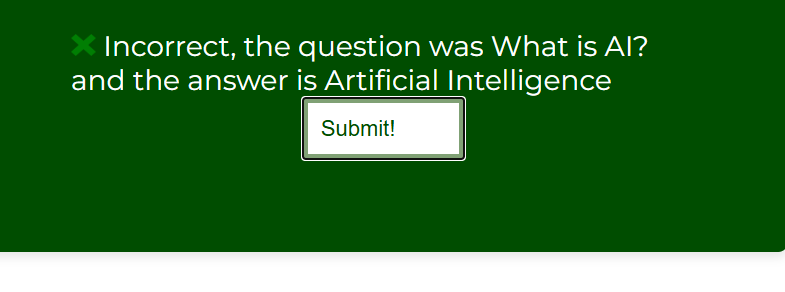

# [QuizAR](https://uche05.github.io/ci-p2-quizar/ "Click to view the deployed site")

- QuizAR is a static site that askes quizzes on the basic knowledge about AI, Artificial Intelligence.
- The QuizAR has been designed so that users at any level, who can read, write, and understand text (mainly in English), and have a drive to learn about AI, can answer the questions.
- QuizAR is especially handy for those wish to be quizzed on about AI and its history and state of the arts.
- QuizAR helps one reinforce their fundamental AI knowledge as they answer the questions provided on QuizAR .
- QuizAR is the AI quiz website for everyone. This quiz site for just for answering question about AI and it is free.
- QuizAR also contains questions on Machine Learning based knowledge.

## Table of Contents

Click here for Table of Contents

[Mock-up Screenshots](#mockup-screenshots)

[UX](#ux)

- [Colour Scheme](#colour-scheme)
- [Typography](#typography)

[User Stories](#user-stories)

- [New site Users](#new-site-users)
- [Returning Site Users](#returning-site-users)

[Wireframes](#wireframes)

- [Mobile Wireframes](#mobile-wireframes)
- [Tablet Wireframes](#tablet-wireframes)
- [Desktop Wireframes](#desktop-wireframes)

[Features](#features)

- [Existing Features](#existing-features)
- [Future Features](#future-features)

[Testing](#testing)

[Deployment](#deployment)

- [Local Deployment](#local-deployment)

  - [Cloning](#cloning)
  - [Forking](#forking)
- [Local vs Deployment](#local-vs-deployment)

[Credits](#credits)

- [Content and Code](#content-and-code)
- [Media](#media)
- [Acknowledgments](#acknowledgements)

## Mock-up Screenshots

Below are two mock-up images of the QuizAR website created using the  `<a href="https://ui.dev/">`"Am I Responsive" website `</a>`.

|                         Screenshot 1                         |                         Screenshot 2                         |
| :----------------------------------------------------------: | :----------------------------------------------------------: |
|  |  |

## UX

- The design for QuizAR was created as a series of wireframes covering mobile, tablet and desktop to determine the initial design and layout of the site.
- QuizAR site was designed with ease of use and simplicity in mind.
- A simple clean look was built so that all a user feels comfortable and neutral when using QuizAR to study.
- QuizAR is meant for people who need to refresh upon their gained knowledge of AI and it's state of the arts.

### Colour Scheme

- The chosen colour scheme for QuizAR is designed to be inviting and have a neutral aesthetic while giving a nice splash of colour aesthetic for color-blinded people.
- The colours used are as follows:-
- #004D00 (Pakistan green)
- #80a175 (Asparagus)
- #eaead9 (Eggshell)
- #ffffff (White)
- I used [coolors.co](https://coolors.co/user/palettes/67013760ef070c000ca35293) to generate my colour palette initially.
- I used [coloors.contrastchecker](https://coolors.co/contrast-checker) to check the contrast between text and background colors used, ensuring readability.
- I used [colorblindor](https://www.color-blindness.com/coblis-color-blindness-simulator/) to ensure my chosen color palette is fit for color-blinded people. This feature was available in Firefox's Developer tools.

### Typography

- I used the Google Font called 'Montserrat' for the QuizAR site.
- I felt that this font had a cool style that is easy to read and that it fitted well with the QuizAR site.

## Icons

- [Font Awesome](https://fontawesome.com) icons were used in the QuizAR site, for GitHub links in the footer and modal and for the search icon in the main weather card.

## User Stories

### New Site Users

- As a new site user, I would like to know what the site is about, so that I understand what the site does.
- As a new site user, I would like to easily see instructions on how to play the quiz.

- As a new site user, I would like to know if certain answers I picked are actually still selected

- As a new user, I want to be able to know of my incorrect answers if I have got any questions on the site wrong

- As a new user (mobile reader), I want to browse through the content easily

- As a new tablet or iPad user, I want to be able to have a nice view of the site as well as navigate efficiently

- As a new user, I would want to be able to navigate back to the start if I have to or even try again and receive final feedback on the number of questions I got right overall..

### Returning Site Users

- As a returning site user, I would like to be able to access the articles via AILib easily once quiz is complete.

### Future Site Users

- As a future site user, I would like to view a more analytic feedback.
- As a future site user, i would like their to be more questions in the quiz site.

## Wireframes

I made use of Google Slides to make the wireframes of my website.

### Mobile Wireframes

|                        Main page                        |
| :------------------------------------------------------: |
|  |

### Tablet Wireframes

|                        Main page                        |
| :-----------------------------------------------------: |
|  |

### Desktop Wireframes

|                        Main page                        |
| :------------------------------------------------------: |
|  |

## Features

### Existing Features

|                   Feature                   |                                               Description                                               |                       Screenshot                       |
| :------------------------------------------: | :------------------------------------------------------------------------------------------------------: | :-----------------------------------------------------: |
|**QuizAR** | The 'QuizAR' link refreshes the page back to home page and it remains at the top-left corner of the website. |    |
|**Instructions for QuizAR** | The 'QuizAR Instructions' contains basic instructions on how the user is to play.   |  |
|**Footer**| The footer contains copyright and owner's name. |  |
|**Question of QuizAR** |The actual quiz section that starts once "Start Quiz" is clicked||
|**Start Quiz Button** |This is the button that removes the instruction section and starts the quiz|    |
|**Submit Button** | This is the submit button that takes user to the next question of the quiz |   |

### Future Features

- Write the privacy notice and terms of use statements and add them to the site.
- Dark and light mode themes.
- Feedback Page to receive constructive criticsm, corrections and suggestions for my site.
- User authentication to enable actual sign-ins into the website.
- Apply legal guidelines into the community of QuizAR (also future prospect) to avoid destructive criticsm and avoid bad/derogatory comments from users to one another.
- Add more questions to better broaden user's prospects and knowledge of AI.
- Apply more questions and better analytic pages to show user progress and results.
- Enhance the look and aesthetic of QuizAR with CSS Frameworks and JS Frameworks.
- Apply AI Based APIs and Analytic based APIs to enable users understand their knowledge capacity of AI better based on quizzes they've taken.

## Tools & Technologies Used

- [Am I Responsive](https://ui.dev/amiresponsive) used to make the markup screenshots to showcase in the readme file.
- [Coolors](https://coolors.co) used to check color contrasts and make interactive color pallettes.
- [Colorblindor](https://www.color-blindness.com/coblis-color-blindness-simulator/) used to see what my website would look like if the users had colorblindness.
- [ChatGPT](https://chatgpt.com/) was utilized to aid me explain certain concepts on the Javascript code and helped to correct me when I made wrong use of code.
- [DevTools](https://google.co.uk/chrome/) used to check regular responsivity, accessibility and overall decent previews of website before and after deployment.
- [Font Awesome](https://fontawesome.com/) used to add icons to the social media icons in the footer.
- [Git](https://git-scm.com) used for version control. (`git add`, `git commit`, `git push`)
- [GitHub](https://github.com) used for secure online code storage.
- [GitHub Pages](https://pages.github.com) used for hosting the deployed front-end site.
- [Google Fonts](https://fonts.google.com/) used to search a suitable font and obtain a download link for that font.
- [Jigsaw CSS Validator](https://jigsaw.w3.org/css-validator/) used to do checks for errors on CSS elements.
- [JSH Linter](https://jshint.com/) used to do checks for errors on the JS code.
- [Microsoft PowerPoint](https://www.microsoft365.com/launch/PowerPoint/?auth=2&home=1) used as wireframing tool and basic image review as well as my markup/ideas panel to just keep a decent view of what I needed the site to look like.
- [VSCode](https://code.visualstudio.com/) used for local IDE for development. It possessed extensions which helped me immensely during my making of the site.
- [W3C HTML Validator](https://validator.w3.org/) used to do checks for errors on HTML elements.
- [W3Schools](https://www.w3schools.com/graphics/svg_intro.asp) used to learn how to create an svg and actually create the favicon myself with their "Try It" Editor and learn new Javascript DOM Methods and Properties.

## [Testing](TESTING.md)

## Deployment

The site was deployed to GitHub Pages. The steps to deploy are as follows:

- In the [GitHub repository](https://github.com/Uche05/ci-p2-quizar), navigate to the Settings tab.
- From the source section drop-down menu, select the **Main** Branch, then click "Save".
- The page will be automatically refreshed with a detailed ribbon display to indicate the successful deployment.

The live link can be found [here](https://uche05.github.io/ci-p2-quizar/).

### Local Deployment

This project can be cloned or forked in order to make a local copy on your own system.

#### Cloning

You can clone the repository by following these steps:

1. Go to the [GitHub repository](https://github.com/Uche05/ci-p2-quizar).
2. Locate the Code button above the list of files and click it.
3. Select if you prefer to clone using HTTPS, SSH, or GitHub CLI and click the copy button to copy the URL to your clipboard.
4. Open Git Bash or Terminal.
5. Change the current working directory to the one where you want the cloned directory.
6. In your IDE Terminal, type the following command to clone my repository:
   - `git clone https://github.com/Uche05/ci-p2-quizar.git`
7. Press Enter to create your local clone.

For Gitpod users, this was not implemented on gitpod, it was from my local PC directly to Github via git and some useful VSCode extensions.

#### Forking

By forking the GitHub Repository, we make a copy of the original repository on our GitHub account to view and/or make changes without affecting the original owner's repository.
You can fork this repository by using the following steps:

1. Log in to GitHub and locate the [GitHub Repository](https://github.com/Uche05/ci-p2-quizar).
2. At the top of the Repository (not top of page) just above the "Settings" Button on the menu, locate the "Fork" Button.
3. Once clicked, you should now have a copy of the original repository in your own GitHub account.

### Local vs Deployment

There are no notable differences between my local developed site and the GitHub pages deployed site.

## Credits

The following are credits to various people and technologies that have directly or otherwise assisted in the creation of the QuizAR site.

### Content and Code

| Source | Location | Notes |
| --- | --- | --- |
|[Javascript Code-Check Aid- ChatGPT](https://chatgpt.com/)| Tool to check javascript code as i wrote it | The JavaScript code I wrote was often quite messy, so I used ChatGPT to help correct and update it. Through this process, I learned how to use arrow functions (=>), the forEach function, and discovered the flexibility JavaScript offers, such as storing objects in arrays— something Python doesn’t do as easily. Thanks to ChatGPT’s guidance, my final JavaScript code was error-free. |
|[Markdown Used](https://github.com/boderg/your-weather)|Markdown| Markdown template was from the given [github repo](https://github.com/boderg/your-weather) for the both "README" and "TESTING"|
|[Code snippets](https://github.com/Uche05/ci-p2-quizar)|Javascript Code Snippets for loading and using enter key | Javascript code use of loading and use of enter key was inspired from  [Love Math Project](https://github.com/Uche05/love-maths-uche05) taught officially by Code Institute.|

### Media

| Name of media | Location | Type | Notes |
| --- | --- | --- | --- |
|[Favicon](assets/images/favicon.svg)| Favicon | SVG | I made the given SVG Favicon with knowledge on how to from W3Schools and ChatGPT|
|[Microsoft Powerpoint](https://www.microsoft365.com/launch/PowerPoint/?auth=2&home=1)|Home page|image| Personally constructed image as wireframe for the quiz app |
|[Favicon used](assets/images/robot.svg)| Favicon and Title | Favicon | With the knowledge I gained from W3schools and ChatGPT, I made the given svg file and used it as my favicon|
|[Icons Used](https://fontawesome.com/search?o=r&m=free)| Feedback after quiz is finished | Icons | I used Font Awesome to obtain the icons used for the feedback after quiz is finished |
| [Feedback Image](https://th.bing.com/th/id/R.7acd2ea060b66321b4fede1bbff805c0?rik=%2fLWFH5zOVsecYw&riu=http%3a%2f%2fwww.clker.com%2fcliparts%2fX%2fR%2fM%2fR%2f6%2fy%2fdark-green-cross-mark-md.png&ehk=ErsbA23GrSaH9fP6mvaWMUBtjCNPaHgXMrYjV%2fKzpnU%3d&risl=&pid=ImgRaw&r=0&sres=1&sresct=1)| Feedback after user answers a question | Image/PNG | Used this image to support feedback given to user after answering a question |

### Acknowledgements

- I would like to thank my Code Institute mentor, [Chris Quinn](https://github.com/10xOXR) for his support throughout the development of this project and hopes he enjoys his vacation time.
- I would like to thank [Code Institute](https://codeinstitute.net) for giving me the opportunity to complete the P2 course.
- I would like to thank the [Code Institute](https://codeinstitute.net) facilitator team, [Iris Smok](https://github.com/Iris-Smok/Iris-Smok), [the Code Institute Student Care Team](studentcare@codeinstitute.net) and [Irene Neville](
irene.neville@codeinstitute.net) for their advice.
- I would like to thank the [Code Institute Slack community](https://code-institute-room.slack.com) and [new friend, Darragh_Drennan](https://code-institute-room.slack.com) for the moral support and general information that helps with my studies with Code Institute.
- I would like to appreciate the [W3schools website](https://www.w3schools.com/) and [OpenAI's ChatGPT](https://chatgpt.com/) for their free websites and resources that educate on many technological  and coding concepts intuitively and enabled me understand and learn how to craft needed stuff for my website.
- I would like to thank my family, for their support and understanding, for believing in me, and allowing me to make this transition into software development.
- I personally enjoyed performing this project as it was a chance to both construct and actually program using coding programming techniques and paradigms; to make a functional content myself through research and personal study.
- Written and edited by Uchechukwu Christian Kpadeuwa
