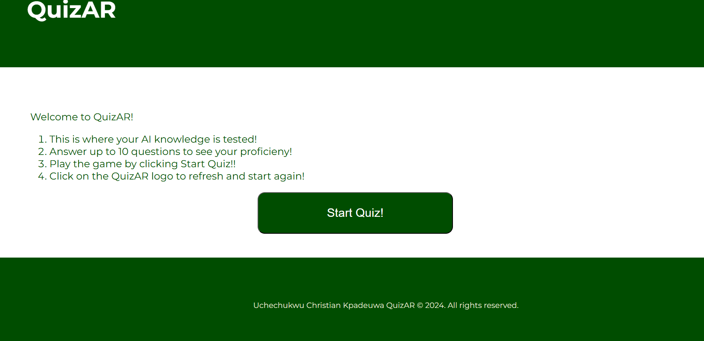
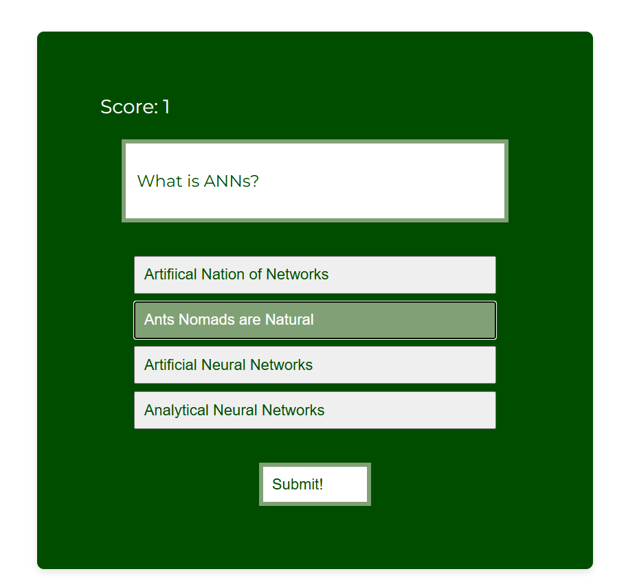

# Testing

Return back to the [README.md](README.md) file.

## Table of Contents

Click here for Table of Contents

- [Code Validation](#code-validation)
  - [HTML](#html)
  - [CSS](#css)
  - [JavaScript](#js)

- [Browser Compatibility](#browser-compatibility)

- [Responsiveness](#responsiveness)

- [Accessibility](#accessibility)

- [User Story Testing](#user-story-testing)

- [Bugs](#bugs)

- [Unfixed Bugs](#unfixed-bugs)

## Code Validation

### HTML

I have used the recommended [HTML W3C Validator](https://validator.w3.org) to validate all of my HTML files.

### CSS

I have used the recommended [CSS Jigsaw Validator](https://jigsaw.w3.org/css-validator) to validate all of my CSS files.

### JS
I have used the recommended [JSHint Linter](https://jshint.com/) to validate all of my JS files.

## Browser Compatibility

I have tested QuizAR on the following browsers to check for compatibility issues.
Once the finally testing was complete no compatibility issues where found.

| Browser |
| :---: |
|Google Chrome|
|Microsoft Edge|
|Mozilla Firefox|
|Samsung Internet Browser(Andriod)|

## Responsiveness

I have tested my deployed project on multiple devices and using the developer tools to check for responsiveness issues.

Click for report

| Device |
| :---: |
|Google Pixel 4 (x2)|
|Samsung A25|
|Ipad Air(DevTools of Ms Edge, Mozilla Firefox and Google Chrome)|
|Iphone 14 Pro Max (Dev Tools of Ms Edge)|

## Accessibility

I have tested my deployed project using the Lighthouse web accessibility evaluation tool in MS Edge Dev Tools to check for any accessibility issues.

## User Story Testing

- As a new site user, I would like to know what the site is about, so that I understand what the site does.
- As a new site user, I would like to easily see instructions on how to play the quiz.

- As a new site user, I would like to know if certain answers I picked are actually still selected

- As a new user, I want to be able to know of my incorrect answers if I have got any questions on the site wrong

- As a new user (mobile reader), I want to browse through the content easily

- As a new tablet or iPad user, I want to be able to have a nice view of the site as well as navigate efficiently

- As a new user, I would want to be able to navigate back to the start if I have to or even try again.

- As a new user I want to receive final feedback on the number of questions I got right overall.

### Returning Site Users

- As a returning site user, I would like to be able to access the articles via AILib easily once quiz is complete.

## Bugs

The following are bugs that I have come across while creating the QuizAR Site.

### HTML

- No bugs to report

- <strong>NOTE</strong>: I made use of a W3C Validator Extension to make the testing process smoother and faster. I still used the validation website afterwards!

### CSS

- No CSS Bugs to report.

### JS

- No JS Bugs to report.

## Unfixed Bugs

There are no remaining bugs that I am aware of.

